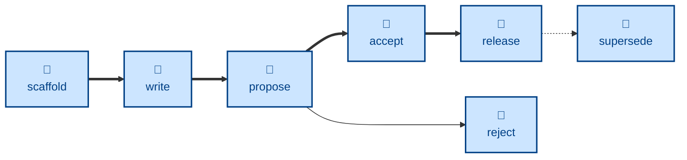

# Agent skills for managing the Software Requirements Specification (SRS)

The skills available to agents in this project are:

- **[scaffold-spec](./scaffold-spec/):** \
  Scaffolds a new proposal, ready for the user to write up.
  Sets the status to `DRAFT`.

- **[write-spec](./write-spec/):** \
  Authors the specification artifacts for a proposal.
  Used during the `DRAFT` state.

- **[propose-spec](./propose-spec/):** \
  Handles the `DRAFT` → `PROPOSED` transition.

- **[accept-spec](./accept-spec/):** \
  Handles the `PROPOSED` → `ACCEPTED` transition.

- **[release-spec](./release-spec/):** \
  Handles the `ACCEPTED` → `RELEASED` transition.

- **[reject-spec](./reject-spec/):** \
  Handles the `PROPOSED` → `REJECTED` transition.

- **[supersede-spec](./supersede-spec/):** \
  Handles the `RELEASED` → `SUPERSEDED` transition.

The **scaffold-spec** skill...

## Compatibility

These skills are compatible with the [Agent Skills](https://agentskills.io/)
convention. Most agent harnesses support this convention natively, but
workarounds may be required for harnesses that do not.
