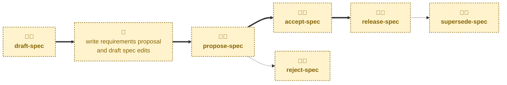

# Agent skills

The following skills are available to support the management of the software
requirements specification via AI agents.

- **[draft-spec](./draft-spec/):** \
  Scaffolds a proposal for changes to the software requirements specification.
  Cuts a `proposal/<slug>` branch from `main`, prepares a fresh proposal from
  the template, opens a pull request in a draft state, and links a discussion
  thread. Sets the status to `DRAFT`.

- **[propose-spec](./propose-spec/):** \
  Handles the `DRAFT` → `PROPOSED` transition.
  Checks the proposal document and the specification edits are complete, and
  takes the pull request out of draft, ready for stakeholder review.

- **[accept-spec](./accept-spec/):** \
  Handles the `PROPOSED` → `ACCEPTED` transition.
  Checks the approval gates and records the decision, leaving the
  pull request open through implementation.

- **[release-spec](./release-spec/):** \
  Handles the `ACCEPTED` → `RELEASED` transition.
  Checks the implementation is live, merges the proposal and its specification
  edits into the `main` trunk, and assigns the proposal its number.

- **[reject-spec](./reject-spec/):** \
  Handles the `PROPOSED` → `REJECTED` transition.
  Reverts the specification edits and merges the proposal document as a
  permanent record of the decision.

- **[supersede-spec](./supersede-spec/):** \
  Handles the `RELEASED` → `SUPERSEDED` transition.
  Retires a released proposal once a later released proposal has replaced or
  removed its feature.

Every one of these skills is interactive: each transition turns on a human
decision, so the agent may pause to confirm the target proposal, the decision,
or a merge.

## Workflow

The skills in this project are focused on the mechanics of managing the lifecycle
of requirements proposals and changes to the specification artifacts.
For help with the specification work itself — working out what a requirement
should be and writing it up as a proposal — you may instruct agents to use the
[**specify**](https://github.com/kieranpotts/skills/tree/latest/dev/skills/specify)
skill in my global skills collection.

## Compatibility

These skills are compatible with the [Agent Skills](https://agentskills.io/)
convention. Most agent harnesses support this convention natively, but
workarounds may be required for harnesses that do not.
