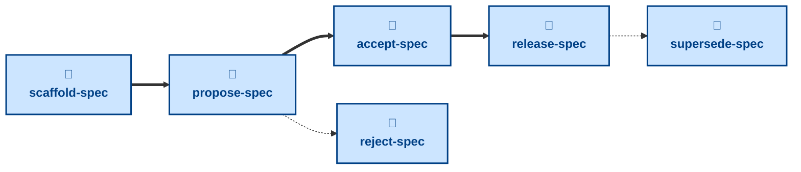

# Agent skills for managing the Software Requirements Specification (SRS)

The skills available to agents in this project are:

- **[scaffold-spec](./scaffold-spec/):** \
  Cuts a `proposal/<slug>` branch from `main`, prepares a fresh proposal from
  the template, and opens a pull request in a draft state.

- **[propose-spec](./propose-spec/):** \
  Checks the proposal is complete and takes the pull request out of draft,
  ready for stakeholder review.

- **[accept-spec](./accept-spec/):** \
  Checks the approval gates and marks the proposal accepted, leaving the
  pull request open through implementation.

- **[release-spec](./release-spec/):** \
  Checks the implementation is live and merges the specification edits into
  the `main` trunk.

- **[reject-spec](./reject-spec/):** \
  Reverts the specification edits and merges the proposal document as a
  permanent record of the decision.

- **[supersede-spec](./supersede-spec/):** \
  Retires a released proposal once a later proposal has replaced or removed
  its feature.

The **scaffold-spec** skill opens a new proposal as a draft PR. After this
step, the user authors the specification edits directly — see
[`docs/best-practices.md`](../../docs/best-practices.md) and the
[`specification/requirements/`](../../specification/requirements/)
subdirectory READMEs for the content conventions — then **propose-spec** puts
the PR up for stakeholder review. From there, **accept-spec** or
**reject-spec** decides the proposal, and once an accepted change is live in
production, **release-spec** lands it in the `main` trunk. A released proposal
may later be retired with **supersede-spec** once a newer proposal replaces
it.

These skills handle process, not substance: how a proposal is scaffolded,
decided, and landed in `main`. For the specification work itself — working out
what the requirement should be and writing it up as a proposal — use the
[**specify**](https://github.com/kieranpotts/skills/tree/latest/dev/skills/specify)
skill in my global skills collection, or author directly against this
repository's own content conventions
([`docs/best-practices.md`](../../docs/best-practices.md)).

## Compatibility

These skills are compatible with the [Agent Skills](https://agentskills.io/)
convention. Most agent harnesses support this convention natively, but
workarounds may be required for harnesses that do not.
