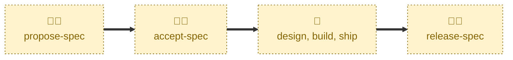

# Accept spec

Handles the `PROPOSED` → `ACCEPTED` transition.

Checks the approval gates — concluded review, a settled specification, and the
Definition of Ready — then records the decision on the proposal document and
swaps the lifecycle label to `#accepted`.

The pull request deliberately stays open. A proposal is released only once its
implementation is live, which is what keeps the `latest/main` specification an
honest record of production.

## Interactivity

Interactive. Where the target proposal cannot be inferred from the checked-out
branch, the agent lists the open `#proposed` pull requests and asks which one
is meant, and it asks who approved the proposal and when if that is not
already established. It is not suited to away-from-keyboard workflows.

## How to invoke

> Accept this proposal

> Approve this proposal

> Mark this proposal as accepted

> Accept spec for user session timeout

> Accept 42

## Recommended models

A mid-tier model is sufficient. The transition is procedural, but judging the
requirement against the Definition of Ready calls for real judgment.

## Suggested workflows

Run this once the stakeholders have decided, and after a final-comment period
has elapsed with no material change to the document. Do not run it to signal
that a proposal is looking promising — that is what leaving it `PROPOSED`
means.

## Related skills

- [**propose-spec**](../propose-spec/) \
  Opens the proposal for the stakeholder review that this skill concludes.

- [**reject-spec**](../reject-spec/) \
  Records the opposite decision at the same gate.

- [**release-spec**](../release-spec/) \
  Lands the accepted proposal once its implementation is live in production.

## References

- [Definition of Ready](../../../docs/definition-of-ready.md) — the readiness
  checklist verified at this gate.

- [Contributing guidelines](../../../CONTRIBUTING.md) — the lifecycle state
  machine and the permitted transitions.
