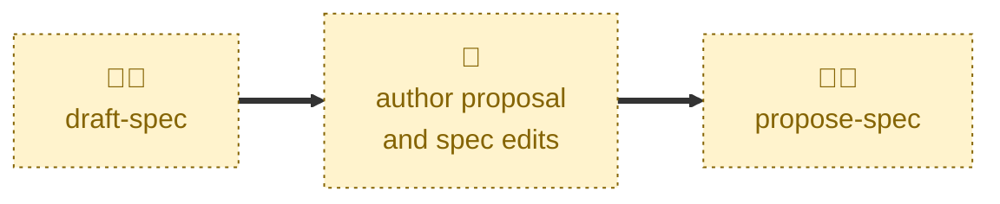

# Draft spec

Scaffolds a proposal for a change to the software requirements specification.

Cuts a `latest/proposal/<slug>` branch from `latest/main` (or `latest/epic/<slug>`),
prepares a fresh proposal document from `proposals/TEMPLATE.md`, opens a draft
pull request, and links a discussion thread. Sets the status to `DRAFT`.

It does not write the substance of the proposal, and it does not edit the
`specification/` artifacts. Both of those are the proposer's work, done once
the scaffolding is in place.

## Interactivity

Interactive. The agent may prompt for the description of the proposed change,
for a suitable slug, and for the change type where the description does not
settle it. It is not suited to away-from-keyboard workflows.

## How to invoke

> Draft a proposal for user session timeout.

> New proposal

> Start a proposal

## Recommended models

A mid-tier model is sufficient. The scaffolding is mechanical, but classifying
the change and locating the specification artifacts it will touch call for
some judgment.

## Suggested workflows

Run this first, at the point the requirement is understood well enough to name
but before anything has been written down. The proposal document and the
specification edits are then authored by hand, and the pull request is taken
out of draft once they are complete.

## Related skills

- [**propose-spec**](../propose-spec/) \
  Takes the pull request this skill opened out of draft, once the proposal
  document and specification edits are complete.

## References

- [Best practices](../../../docs/best-practices.md) — conventions for
  authoring specification content.

- [Contributing guidelines](../../../CONTRIBUTING.md) — the lifecycle state
  machine and the workflow this skill starts.
