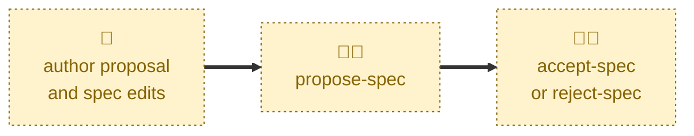

# Propose spec

Handles the `DRAFT` → `PROPOSED` transition.

Checks the proposal document and the `specification/` edits are complete, sets
the status, applies the `#proposed` label, and takes the pull request out of
draft so stakeholders can review it.

It applies a readiness gate. It does not fill in what is missing, and it
decides nothing about the proposal's merits.

## Interactivity

Interactive. Where the target proposal cannot be inferred from the checked-out
branch, the agent lists the open draft pull requests and asks which one is
meant. It is not suited to away-from-keyboard workflows.

## How to invoke

> This proposal is ready for review

> Mark the proposal ready

> Take this out of draft

> Propose user-session-timeout

> Propose 42

## Recommended models

A mid-tier model is sufficient. Applying the readiness gate calls for judgment
about whether a section is substantive, but the transition itself is
procedural.

## Suggested workflows

Run this once the proposal document and the specification edits are both
complete. Do not run it to solicit early feedback — that is what the
discussion thread is for, and the proposal can stay in `DRAFT` while it
happens.

## Related skills

- [**draft-spec**](../draft-spec/) \
  Scaffolds the branch, document, and pull request that this skill takes out
  of draft.

- [**accept-spec**](../accept-spec/) \
  Records the stakeholders' approval, the next transition after this one.

- [**reject-spec**](../reject-spec/) \
  Records the stakeholders' rejection, the alternative next transition.

## References

- [Contributing guidelines](../../../CONTRIBUTING.md) — the lifecycle state
  machine and the permitted transitions.
