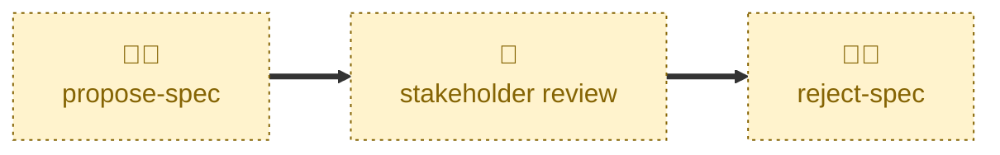

# Reject spec

Handles the `PROPOSED` → `REJECTED` transition.

Reverts the `specification/` edits, records the decision and its rationale on
the proposal document, squash-merges that document into the `latest/main` trunk,
closes the discussion thread, and assigns the proposal its number.

The rejected proposal is archived permanently in `proposals/`. Nothing is ever
deleted: the value of merging a rejection is that a future reader can see what
was turned down and why.

## Interactivity

Interactive. The agent asks the user outright to confirm the decision is to
reject before it touches anything, presents the specification edits for
confirmation before reverting them, and confirms again before merging. It is
not suited to away-from-keyboard workflows.

## How to invoke

> Reject this proposal

> This proposal was not approved

> Reject user-session-timeout

> Reject 42

## Recommended models

A mid-tier model is sufficient. The steps are procedural, but reverting the
specification edits precisely — and only those edits — calls for care.

## Suggested workflows

Run this once stakeholders have concluded the proposal will not be taken
forward. There is no path to rejection from `DRAFT`: an unwanted draft is
simply abandoned and its branch closed, with nothing merged.

## Related skills

- [**propose-spec**](../propose-spec/) \
  Opens the proposal for the stakeholder review that this skill concludes.

- [**accept-spec**](../accept-spec/) \
  Records the opposite decision at the same gate.

- [**release-spec**](../release-spec/) \
  Lands an accepted proposal, keeping its specification edits rather than
  reverting them.

## References

- [Contributing guidelines](../../../CONTRIBUTING.md) — the lifecycle state
  machine, the squash-commit message form, and the numbering rule.
