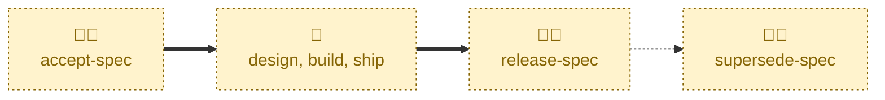

# Release spec

Handles the `ACCEPTED` → `RELEASED` transition.

Checks the implementation is live in production, squash-merges the proposal
document and its `specification/` edits into the `main` trunk, closes the
discussion thread, and assigns the proposal its number in
`proposals/INDEX.md`.

This is the point at which `main` is updated to describe the new state of the
system. Everything before it is a proposal about a system that does not yet
behave that way.

## Interactivity

Interactive. Where the target proposal cannot be inferred from the checked-out
branch, the agent lists the open `#accepted` pull requests and asks which one
is meant, and it always confirms before merging. It is not suited to
away-from-keyboard workflows.

## How to invoke

> Release this proposal

> This proposal is live

> The implementation shipped

> Release user-session-timeout

> Release 42

## Recommended models

A mid-tier model is sufficient. The transition is procedural, but confirming
the specification edits still match what actually shipped calls for some
judgment.

## Suggested workflows

Run this only after the change is live for real users — not when it merges,
and not when it reaches a staging environment. Releasing early leaves `main`
describing a system that does not exist.

## Related skills

- [**accept-spec**](../accept-spec/) \
  Records the approval that queues the implementation this skill lands.

- [**reject-spec**](../reject-spec/) \
  Lands a proposal that was decided the other way, reverting the
  specification edits first.

- [**supersede-spec**](../supersede-spec/) \
  Retires a released proposal once a later one replaces or removes its
  feature.

## References

- [Contributing guidelines](../../../CONTRIBUTING.md) — the lifecycle state
  machine, the squash-commit message form, and the numbering rule.
