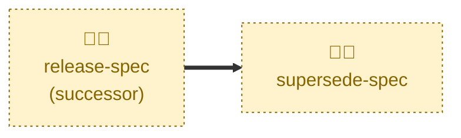

# Supersede spec

Handles the `RELEASED` → `SUPERSEDED` transition.

Retires a released proposal once a later released proposal has replaced or
removed its feature: sets the status and the `Superseded by` cross-reference,
updates the row in `proposals/INDEX.md`, and swaps the lifecycle label on the
original pull request.

This is the only transition out of `RELEASED`, and the only one that commits
straight to `latest/main`. Both proposals are already merged, and the handful of
fields it touches are the only ones a merged proposal may still change — so
there is nothing for a pull request to review.

It does not touch `specification/`. The edits that actually remove or replace
the feature rode on the successor proposal's own pull request, and landed when
that proposal was released.

## Interactivity

Interactive. The agent may prompt for either proposal where the pair cannot be
inferred from the user's description, and it flags rather than fixes a missing
back-link on the successor. It is not suited to away-from-keyboard workflows.

## How to invoke

> Supersede the catalog read API proposal.

> The catalog read API is now superseded by the catalog read API v2.

## Recommended models

A fast, cheap model is sufficient. The work is a small, well-defined set of
field edits, with no judgment about the merits of either proposal.

## Suggested workflows

Run this immediately after the successor proposal is released, so the archive
never claims two proposals are simultaneously in effect over the same feature.

## Related skills

- [**release-spec**](../release-spec/) \
  Lands the successor proposal whose release is what makes this supersession
  possible.

- [**draft-spec**](../draft-spec/) \
  Scaffolds that successor proposal, whose `Supersedes` field this skill
  checks for the reciprocal link.

## References

- [Contributing guidelines](../../../CONTRIBUTING.md) — the lifecycle state
  machine and the rule that merged proposals are immutable.
