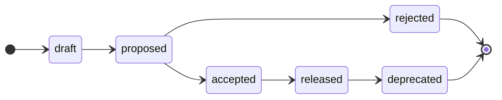

# Contributing

<!-- Agents MUST read ./AGENTS.md. This document is for humans. -->

Anyone with write access to this repository may propose changes to the functional and non-functional requirements of the system. The product managers are ultimately responsible for accepting or rejecting proposals, for managing their lifecycle, and for maintaining the specification. Automation and agentic tools may be used to support parts of this process — see [Skills](#skills).

## Rules

The capitalized words REQUIRED, MUST, MUST NOT, RECOMMENDED, SHOULD, SHOULD NOT, OPTIONAL, and MAY are to be interpreted as described in [IETF RFC 2119](https://www.ietf.org/rfc/rfc2119.txt).

- MUST write in American English.

- The [`specification/`](./specification/) directory on `main` MUST describe the production system as it exists now. It is the authoritative record of the current state of the system.

- A proposal MUST be a single, atomic change — one feature or quality requirement that can be reviewed, decided, and shipped independently of any other. Author it on a `proposal/<slug>` branch cut from `main`, and open a pull request titled `feature: <slug>` or `quality: <slug>`.

- Every proposal pull request MUST carry exactly one type label — `FEATURE` or `QUALITY` — matching the kind of change.

- Every proposal pull request MUST have an associated discussion thread, opened with the pull request and used for all review feedback. The thread is closed once the proposal is accepted or rejected.

- The current lifecycle state of a proposal is tracked via a label on its pull request (`#proposed`, `#accepted`, `#rejected`, `#released`, `#deprecated`). A pull request is opened as a GitHub **draft** while the document is still being refined; this draft state — not a label — represents work in progress.

- A proposal is assigned a sequential number at merge, recorded in [`proposals/INDEX.md`](./proposals/INDEX.md). The number lives only in the index; no proposal directory is ever renamed.

- Once a proposal is merged into `main`, its document is immutable. To revisit a decision, open a new proposal that supersedes the original.

- The GitHub issue tracker is used only for maintenance work on this repository itself (the `MAINTENANCE` template) and for grouping interdependent proposals (the `EPIC` template). Proposals themselves are proposed, decided, and archived entirely through pull requests; open-ended brainstorming happens in [discussions](https://github.com/kieranpotts/specs/discussions).

## Branching-and-merging workflow

The `main` trunk is the default branch. The contents of [`specification/`](./specification/) on `main` is the authoritative record of the system as it exists in production right now.

Proposals are developed on `proposal/<slug>` branches cut from `main`, and integrated back into `main` via pull requests. A proposal's pull request stays open until the corresponding changes in code and configuration are in production: it is not enough for a proposal to be _approved_ by the product managers; the change MUST also be designed, built, tested, and released before the proposal is considered "done" and its pull request is merged. Thus the `main` specification stays current with production.

The one exception is a **rejected** proposal: its specification edits are reverted, and only the proposal document is merged — the system is unchanged, so its specification does not change.

See the [lifecycle](#proposal-lifecycle) section for the full set of gates that must be met before a proposal can be merged.

## Branch, pull request, and commit conventions

A proposal is authored on a `proposal/<slug>` branch, where `<slug>` is a short, hyphen-delimited description (eg. `proposal/user-session-timeout`). The pull request is titled `feature: <slug>` or `quality: <slug>`.

Use the commit message shown for each lifecycle step below, so the history reads identically whether a human or an agent drove the change. The [skills](#skills) write these for you.

| Step | Commit message |
| --- | --- |
| Scaffold a new proposal | `feature: <slug>` or `quality: <slug>` |
| Link the discussion thread | `chore: link discussion thread for <slug>` |
| Mark ready for review (draft → proposed) | `chore: mark <slug> ready for review` |
| Accept (proposed → accepted) | `chore: accept <slug>` |
| Release (accepted → released) | `chore: release <slug> (proposal <NNNN>)` |
| Reject (proposed → rejected) | `chore: reject <slug> (proposal <NNNN>)` |
| Deprecate (released → deprecated) | `chore: deprecate <slug>` |

`<NNNN>` is the four-digit number assigned in [`INDEX.md`](./proposals/INDEX.md) at merge — the highest existing number plus one, zero-padded (eg. `0007`).

## Proposing a change

### Step 1: Open a discussion thread (REQUIRED)

Every proposal has an associated **discussion thread**, and it is where _all_ review feedback is gathered — not the pull request's own comments. This keeps the pull request focused on the evolution of the proposal document and the specification edits.

Open a [discussion](https://github.com/kieranpotts/specs/discussions) using the form for the proposal's type (Feature or Quality). You MAY open it early, to brainstorm before a firm proposal exists, but it MUST exist by the time the pull request is opened (even a draft pull request). Link the discussion and the pull request to each other. The thread stays open for the life of the proposal and is closed once the proposal is accepted or rejected.

(The GitHub issue tracker is _not_ used for proposals — it is reserved for repository maintenance and for `EPIC` groupings of interdependent proposals.)

### Step 2: Open a pull request (REQUIRED to progress a proposal)

A pull request is the formal vehicle for a proposal. Open it as soon as you are ready to start writing the proposal document; its associated discussion thread (step 1) MUST exist by this point.

1. Branch off `main` as `proposal/<slug>`.

2. Copy [`proposals/TEMPLATE.md`](./proposals/TEMPLATE.md) to `proposals/<slug>/README.md`. The proposal lives in its own directory, so you may add supporting artifacts — wireframes, mock-ups, data — alongside the `README.md` and link them from its `References` section. Fill it out: link the discussion thread (step 1) via the `Discussion thread` field, and describe the change in full — the rationale, the impact on the business and its customers, and the alternatives considered.

3. Edit the contents of [`specification/`](./specification/) to reflect the intended final state of the system after the change ships. You may add, modify, or delete specification artifacts as needed to describe the desired end state. (A rejected proposal's edits are reverted before merge; see below.)

4. Commit your changes and open the pull request **as a GitHub draft**, titled `feature: <slug>` or `quality: <slug>`. Apply exactly one type label — `FEATURE` or `QUALITY`. Fill out the top of the PR template (above the horizontal rule) and link the discussion thread; leave the checklist below the rule for the product managers.

5. Keep the pull request in draft while you refine it. When the document and spec edits are complete and ready for full stakeholder review, mark the pull request **ready for review** and apply the `#proposed` label.

> [!TIP]
> You don't have to do this by hand: [`/draft-proposal`](./.agents/skills/draft-proposal/) scaffolds the document, opens the draft pull request, applies the type label, and opens the discussion thread; [`/propose-proposal`](./.agents/skills/propose-proposal/) then marks it ready for review once it is complete.

## Proposal lifecycle

The [specification artifacts](./specification/) always reflect the current state of the system as experienced by real users in production right now. Changes to that state are introduced through proposals.

Each proposal moves through a defined state machine. From `proposed` onward, the current state is shown by a lifecycle label on the pull request; before that, the proposal is simply an open **draft** pull request. Only the product managers may take the decision transitions (`accepted`, `rejected`, `released`, `deprecated`).

- **Draft**: The proposal is being written. Its pull request is open as a GitHub draft and carries only its type label — there is no `#draft` label; "draft" is the pull request's own draft flag. Not yet ready for review. The proposer MAY solicit early feedback in the discussion thread.

- **Proposed**: The proposal is complete and open for a decision. The proposer has marked the pull request ready for review and labeled it `#proposed`. It is now formally reviewed and negotiated with stakeholders; from this point, the author should not make further material changes unless reviewers request them.

- **Accepted**: The proposal has been approved by the product managers, who queue the work for implementation (eg. opening issues against the relevant code repositories and cross-referencing them from the proposal). The discussion thread is closed. The pull request remains open until the implementation is released to production; the document and the accompanying specification edits MAY continue to evolve during this period — in response to technical feedback, implementation discoveries, or feedback from real users in beta tests or staged roll-outs.

- **Rejected**: The proposal will not be taken forward. The accompanying specification edits are reverted, the proposal is assigned its number in [`INDEX.md`](./proposals/INDEX.md), the discussion thread is closed, and the proposal document is merged into `main` — preserved permanently in [`proposals/`](./proposals/) as the record of the decision and its rationale. The system is unchanged, so its specification does not change.

- **Released**: The implementation is live in production. The proposal's specification edits are merged into `main`, and the proposal is assigned its number in [`INDEX.md`](./proposals/INDEX.md). An accepted decision stays in effect until a later proposal deprecates it.

- **Deprecated**: A previously released proposal that is no longer in effect, for example because a later proposal superseded or removed the feature.

### Permitted transitions

The proposer drives a proposal up to `proposed` — drafting it, then marking the pull request ready for review. Only the product managers take the decision transitions. Each transition has its own [skill](#skills) that verifies the gates for that transition and applies the matching label.

| From | To | Skill | Condition |
| --- | --- | --- | --- |
| _(new PR)_ | `draft` | [`/draft-proposal`](./.agents/skills/draft-proposal/) | A draft pull request is opened with the scaffolded document, a type label, and a discussion thread. |
| `draft` | `#proposed` | [`/propose-proposal`](./.agents/skills/propose-proposal/) | Document and spec edits complete and free of template boilerplate; PR marked ready for review and labeled `#proposed`. |
| `#proposed` | `#accepted` | [`/accept-proposal`](./.agents/skills/accept-proposal/) | Stakeholder review and final-comment period concluded; `Depends on` proposals accepted; approved; discussion closed. |
| `#proposed` | `#rejected` | [`/reject-proposal`](./.agents/skills/reject-proposal/) | Review concluded; not approved; spec edits reverted; number added to `INDEX.md`; discussion closed; merged as record. |
| `#accepted` | `#released` | [`/release-proposal`](./.agents/skills/release-proposal/) | Implementation shipped to production; number added to `INDEX.md`; spec edits merged. |
| `#released` | `#deprecated` | _(manual)_ | A later proposal has superseded or removed the feature. |

Transitions not listed are not permitted. A proposal MUST NOT move backwards (eg. from `#proposed` back to draft) and MUST NOT skip states (eg. from draft directly to `#accepted`).

### Immutability

A proposal document is treated as immutable once its pull request is merged into `main`. For accepted proposals, this happens at the `#released` state, after the implementation ships to production; for rejected proposals, shortly after the rejection decision.

While a proposal is still open — including throughout the `#accepted` implementation phase — its document and the accompanying specification edits may be updated as needed. This accommodates the feedback loops that naturally arise during implementation.

To revisit a past decision already merged to `main`, open a new proposal that supersedes the original and cross-reference the two using the `Supersedes` / `Superseded by` fields.

## Skills

This repository ships a set of **agent skills** — invoked as slash commands through agentic tools such as Claude Code — that automate the proposal workflow, with **one skill per state transition**. They live in [`.agents/skills/`](./.agents/skills/); each knows the gate rules for its own transition and will not proceed until they are met. You can always perform any step by hand instead.

- [`/draft-proposal`](./.agents/skills/draft-proposal/) — _start a new proposal_: scaffold the branch and document, open a draft pull request with a type label, and open the discussion thread.
- [`/propose-proposal`](./.agents/skills/propose-proposal/) — _draft → proposed_: confirm the document and spec edits are complete, apply `#proposed`, and take the pull request out of draft.
- [`/accept-proposal`](./.agents/skills/accept-proposal/) — _proposed → accepted_: verify the approval gates, set the document to `ACCEPTED`, label `#accepted`, and close the discussion thread.
- [`/release-proposal`](./.agents/skills/release-proposal/) — _accepted → released_: once the implementation is live, record the number in `INDEX.md`, set the document to `RELEASED`, and prepare the pull request for merge.
- [`/reject-proposal`](./.agents/skills/reject-proposal/) — _proposed → rejected_: revert the spec edits, record the number in `INDEX.md`, set the document to `REJECTED`, close the discussion, and prepare the pull request for merge as a permanent record.

Each skill's directory holds a `README.md` (how to invoke it, with examples) and a `SKILL.md` (the full instructions and transition rules).
