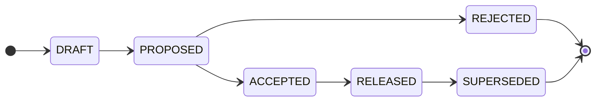

# Contributing

<!-- Agents MUST read ./AGENTS.md. This document is for humans. -->

These contributing guidelines provide step-by-step instructions for iterating on product specifications. The focus here is on the mechanics and guardrails of the proposal process.  See the [documentation](./docs/) for more general guidance on how to get the most out of the SRS process.

Product managers are responsible for accepting or rejecting proposals, for managing their lifecycle, and for maintaining the specification of the "as-is" system. However, anyone with write access to this repository may propose changes to the functional and non-functional requirements of the system, for product consideration.

> [!NOTE]
> The capitalized words REQUIRED, MUST, MUST NOT, RECOMMENDED, SHOULD, SHOULD NOT, OPTIONAL, and MAY, are to be interpreted as described in [IETF RFC 2119](https://www.ietf.org/rfc/rfc2119.txt).

## The proposal lifecycle

The [specification artifacts](./specification/) always reflect the current state of the system as experienced by real users in production right now. Changes to that state are introduced through proposals.

Each proposal moves through a defined state machine. Product managers are responsible for applying. The current state of a proposal is shown in the document's `Status` field. In addition, to make it easier to search and filter pending proposals, corresponding labels are applied to open pull requests: `#proposed`, `#accepted`, etc.

The states are:

- `DRAFT`: The proposal is being written. Its pull request is open as a draft, which means it's not yet ready for review. Early feedback may be solicited via the discussion thread.

- `PROPOSED`: The proposal is complete and open for a decision. The idea is now formally reviewed and negotiated with relevant stakeholders (both technical and non-technical).

- `ACCEPTED`: The proposal has been approved by the product managers. The discussion thread is closed. The pull request remains open until the implementation is released to production. The specifications documents may continue to evolve during this period — in response to technical feedback, implementation discoveries, or feedback from real users in beta tests or staged roll-outs.

- `REJECTED`: The proposal will not be taken forward. The accompanying specification edits are reverted, but the proposal document is preserved and merged to `main`. After merge, the proposal is given a unique reference and listed in the [proposals index](./proposals/INDEX.md). Thus, all proposed changes to the software requirements specifications, whether ultimately accepted or rejected, are preserved indefinitely as a record of the decision and its rationale. But the actual requirements specification in `main` always reflects the current "as-is" production system and captures no traces of rejected or superseded specifications.

- `RELEASED`: An accepted change request is now live in production. Both the proposal document and the changes to the specification artifacts are merged into `main`. After merge, the proposal is given a unique reference and listed in the [proposals index](./proposals/INDEX.md). A released proposal stays in effect until a later proposal supersedes it.

- `SUPERSEDED`: A previously released proposal that is no longer in effect, because a later proposal replaced or removed the feature.

The proposer drives a proposal up to `PROPOSED` — drafting it, then marking the pull request ready for review. Only the product managers take the decision transitions.

| From    | To              | Condition                                |
| ------- | --------------- | ---------------------------------------- |
| _(new)_ | `DRAFT`         | Initial state, scaffolding the document. |
| `DRAFT` | `PROPOSED`      | Proposal and spec edits complete.        |
| `PROPOSED` | `ACCEPTED`   | Final comments concluded. Accepted.      |
| `PROPOSED` | `REJECTED`   | Final comments concluded. Rejected.      |
| `ACCEPTED` | `RELEASED`   | Implementation shipped to production.    |
| `RELEASED` | `SUPERSEDED` | Superseded by a later proposal.          |

Transitions not listed are not permitted. A proposal MUST NOT move backwards (eg. from `PROPOSED` back to `DRAFT`) and MUST NOT skip states (eg. from `DRAFT` directly to `ACCEPTED`).

> [!TIP]
> This repository includes a suite of [agent skills](./.agents/skills/) that automate the state transitions and enforce the gate rules. It is RECOMMENDED to get AI agents to apply state transitions, by prompting the agents to use these skills. Doing so helps to keep the process consistent.

## Workflow

### Step 1: Open a discussion thread (REQUIRED)

Every proposal has an associated **discussion thread**, and it is where _all_ review feedback is gathered — not the pull request's own comments. This keeps the pull request focused on the evolution of the proposal document and the specification edits.

Open a [discussion](https://github.com/kieranpotts/specs/discussions) using the form for the proposal's type (Feature, Quality, or Epic). You MAY open it early, to brainstorm before a firm proposal exists, but it MUST exist by the time the pull request is opened (even a draft pull request). Link the discussion and the pull request to each other. The thread stays open for the life of the proposal and is closed once the proposal is accepted or rejected.

(The GitHub issue tracker is _not_ used for proposals — it is reserved for repository maintenance only.)

### Step 2: Open a pull request (REQUIRED to progress a proposal)

A pull request is the formal vehicle for a proposal. Open it as soon as you are ready to start writing the proposal document; its associated discussion thread (step 1) MUST exist by this point.

1. Branch off `main`: as `proposal/<slug>` for a feature or quality proposal, or as `epic/<slug>` for an epic.

2. Copy [`proposals/TEMPLATE.md`](./proposals/TEMPLATE.md) to `proposals/<slug>/README.md`. The proposal lives in its own directory, so you may add supporting artifacts — wireframes, mock-ups, data — alongside the `README.md` and link them from its `References` section. Fill it out: link the discussion thread (step 1) via the `Discussion thread` field, and describe the change in full — the rationale, the impact on the business and its customers, and the alternatives considered.

3. Edit the contents of [`specification/`](./specification/) to reflect the intended final state of the system after the change ships. You may add, modify, or delete specification artifacts as needed to describe the desired end state. (A rejected proposal's edits are reverted before merge; see below.)

4. Commit your changes and open the pull request **as a GitHub draft**, titled `feature: <description>`, `quality: <description>`, or `epic: <description>` (a short prose title, not the slug). Apply exactly one type label — `FEATURE`, `QUALITY`, or `EPIC`. Fill out the top of the PR template (above the horizontal rule) and link the discussion thread; leave the checklist below the rule for the product managers.

5. Keep the pull request in draft while you refine it. When the document and spec edits are complete and ready for full stakeholder review, mark the pull request **ready for review** and apply the `#proposed` label.

> [!TIP]
> You don't have to do this by hand: [`/draft-spec`](./.agents/skills/draft-spec/) scaffolds the document, opens the draft pull request, applies the type label, and opens the discussion thread; [`/propose-spec`](./.agents/skills/propose-spec/) then marks it ready for review once it is complete.

## Rules

- MUST write in American English.

- The [`specification/`](./specification/) directory on `main` MUST describe the production system as it exists now. It is the authoritative record of the current state of the system.

- Every proposal pull request MUST carry exactly one type label — `FEATURE`, `QUALITY`, or `EPIC` — matching the kind of change.

- A `FEATURE` or `QUALITY` proposal MUST be a single, atomic change — one requirement that can be reviewed, decided, and shipped independently of any other. Author it on a `proposal/<slug>` branch cut from `main`, and open a pull request titled `feature: <description>` or `quality: <description>` (a short prose title, not the slug).

- An `EPIC` proposal spans multiple feature and quality requirements and is used for large-scale initiatives — for example, specifying a greenfield system from scratch. Author it on an `epic/<slug>` branch cut from `main`, and open a pull request titled `epic: <description>`. Individual feature and quality proposals that are part of an epic reference it via their `Depends on` field.

- Every proposal pull request MUST have an associated discussion thread, opened with the pull request and used for all review feedback. The thread is closed once the proposal is accepted or rejected.

- The current lifecycle state of a proposal is tracked via a label on its pull request (`#proposed`, `#accepted`, `#rejected`, `#released`, `#superseded`). A pull request is opened as a GitHub **draft** while the document is still being refined; this draft state — not a label — represents work in progress.

- Once a requirement is `PROPOSED`, from this point on in its lifecycle, the author SHOULD NOT make further material changes to the proposed specifications, except in response to reviewer feedback.

- A proposal is assigned a sequential number at merge, recorded in [`proposals/INDEX.md`](./proposals/INDEX.md). The number lives only in the index; no proposal directory is ever renamed.

- Proposal branches are squash-merged into `main`. The message of the squash commit MUST take the form `<type>: <description> - RELEASED|REJECTED`, where `<type>` is `feature`, `quality`, or `epic`, and `<description>` is a short prose title of the proposal, written full lowercase (eg. `feature: time out idle user sessions - RELEASED`) — not the hyphenated branch slug. A released proposal merges at `#released`; a rejected one at `#rejected`.

- Once a proposal is merged into `main`, its document is immutable. To revisit a decision, open a new proposal that supersedes the original.

- The GitHub issue tracker is used only for maintenance work on this repository itself (the `MAINTENANCE` template). Proposals are proposed, decided, and archived entirely through pull requests; open-ended brainstorming happens in [discussions](https://github.com/kieranpotts/specs/discussions).

<!--
### Immutability

A proposal document is treated as immutable once its pull request is merged into `main`. For accepted proposals, this happens at the `RELEASED` state, after the implementation ships to production; for rejected proposals, shortly after the rejection decision.

While a proposal is still open — including throughout the `ACCEPTED` implementation phase — its document and the accompanying specification edits may be updated as needed. This accommodates the feedback loops that naturally arise during implementation.

To revisit a past decision already merged to `main`, open a new proposal that supersedes the original and cross-reference the two using the `Supersedes` / `Superseded by` fields.

## Branching-and-merging workflow

The `main` trunk is the default branch. The contents of [`specification/`](./specification/) on `main` is the authoritative record of the system as it exists in production right now.

Proposals are developed on `proposal/<slug>` branches cut from `main`, and integrated back into `main` via pull requests. A proposal's pull request stays open until the corresponding changes in code and configuration are in production: it is not enough for a proposal to be _approved_ by the product managers; the change MUST also be designed, built, tested, and released before the proposal is considered "done" and its pull request is merged. Thus the `main` specification stays current with production.

The one exception is a **rejected** proposal: its specification edits are reverted, and only the proposal document is merged — the system is unchanged, so its specification does not change.

See the [lifecycle](#the-proposal-lifecycle) section for the full set of gates that must be met before a proposal can be merged.

## Branch, pull request, and commit conventions

A proposal is authored on a `proposal/<slug>` branch, where `<slug>` is a short, hyphen-delimited description (eg. `proposal/user-session-timeout`). The hyphenated slug is used **only** for the branch name and the proposal directory (`proposals/<slug>/`). Everywhere a commit message or pull request title appears, use a short prose **description** of the proposal, written full lowercase — not the slug (eg. the PR title is `feature: time out idle user sessions`, not `feature: user-session-timeout`).

Use the commit message shown for each lifecycle step below, so the history reads identically whether a human or an agent drove the change. The [agent skills](./.agents/skills/) write these for you. Each `<description>` is the prose proposal title, lowercase.

| Step | Commit message |
| --- | --- |
| Scaffold a new proposal | `feature: <description>`, `quality: <description>`, or `epic: <description>` |
| Link the discussion thread | `chore: link discussion thread for <description>` |
| Mark ready for review (`DRAFT` → `PROPOSED`) | `chore: mark <description> ready for review` |
| Accept (`PROPOSED` → `ACCEPTED`) | `chore: accept <description>` |
| Release (`ACCEPTED` → `RELEASED`) | `chore: release <description> (proposal <NNNN>)` |
| Reject (`PROPOSED` → `REJECTED`) | `chore: reject <description> (proposal <NNNN>)` |
| Supersede (`RELEASED` → `SUPERSEDED`) | `chore: supersede <description>` |

`<NNNN>` is the four-digit number assigned in [`INDEX.md`](./proposals/INDEX.md) at merge — the highest existing number plus one, zero-padded (eg. `0007`).-->

## Contributor license agreement

<!-- Delete this for closed source projects. -->

By opening a pull request to this repository, you accept and agree to the following terms and conditions:

- You agree that your contribution may be distributed under the terms of the [CC0 1.0 Universal license](./LICENSE.txt), effectively releasing it to the public domain.

- You certify that your contribution is either created in whole by you and you have the right to distribute it under the designated license, or is based on a previous work with a compatible license that permits distribution and modification under the designated license.

- You understand and agree that your contribution is public and that a record of it, including all personal information you submit with it, is maintained indefinitely and may be redistributed consistent with the designated license.
