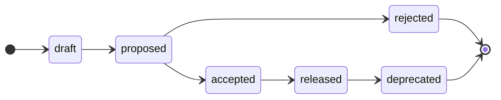

# Contributing

<!-- Agents MUST read ./AGENTS.md. This document is for humans. -->

Anyone with write access to this repository may propose changes to the functional and non-functional requirements of the system. The product managers are ultimately responsible for accepting or rejecting proposals. They are also responsible for managing the lifecycle of proposals, and for maintaining the specification. Automation and agentic tools may be used to support parts of this process.

## Branching-and-merging workflow

The `main` trunk is the default branch of this repository. The contents of the [specification directory](./specification/) on `main` is the authoritative record of the current state of the system as it exists in production right now.

Proposals to change the system's specification are developed in `proposal/*` branches cut from `main`. The updated specifications are integrated into `main` via pull requests. Those PRs stay open until the necessary changes in code and configuration are in production. It is not enough for a proposal to be approved by the product managers. The corresponding changes MUST also be designed, built, tested, and released to production before a proposal is considered "done" and its PR is merged. Thus, the `main` specification stays current with production.

See the [lifecycle](#proposal-lifecycle) section below for the full set of conditions that must be met before a proposal can be merged.

## Proposing a change

The golden rule is that each proposal SHOULD be focused on a single atomic change — ideally, one feature or quality requirement that can be reviewed, decided, and shipped independently of any other proposal. If you have multiple changes to propose, open multiple pull requests. If there are dependencies between those proposals, wrap them in an **Epic** task in the issue tracker.

### Step 1: Open an issue (OPTIONAL)

Before writing a full proposal, the proposer MAY open a GitHub issue to gather early feedback and gauge whether the idea is worth progressing. Choose the appropriate template:

- **Feature**: To canvass opinion on a new or changed functional requirement.

- **Quality**: To canvass opinion on a new or changed non-functional requirement.

An issue is a lightweight tool to surface an idea to stakeholders and get initial triage from the product managers without committing to a full proposal. If the proposer subsequently decides to move forward with their idea, they close the issue and open a pull request (see step 3). If the idea is not pursued, the issue is simply closed without further action.

### Step 2: Open a discussion (OPTIONAL)

If the idea needs more in-depth exploration before a firm proposal can be written, the proposer MAY open a [discussion](https://github.com/kieranpotts/specs/discussions) in addition to the issue. There MUST be bidirectional cross-references between the discussion thread and the issue.

Discussion threads are open-ended and well-suited to early brainstorming.

### Step 3: Open a pull request (REQUIRED to progress a proposal)

A pull request is the formal vehicle for a proposal. It MAY be opened at any point — with or without a prior issue or discussion — as soon as the proposer is ready to commit to writing the full proposal document.

Follow these steps to prepare the pull request:

1. Branch off `main` using the naming convention `proposal/[description]`, where `[description]` is a short hyphen-delimited slug. Example: `proposal/user-session-timeout`.

2. Copy [`proposals/TEMPLATE.md`](./proposals/TEMPLATE.md) to `proposals/[description].md` and fill it out. If an issue was opened, set the `Issue` field to link back to it. Describe the change in full detail: the rationale, the expected impact on the business and its customers, and the alternatives that were considered. Follow the template, but extend it with other context and artifacts as you see fit.

3. Edit the contents of the [specification directory](./specification/) to reflect the intended final state of the system after the change ships. You may add, modify, or delete specification artifacts as you see necessary to reflect the desired end state.

4. Commit your changes and open a pull request titled `feature: [description]` (for functional changes) or `quality: [description]` (for non-functional changes). Fill out the top bit of the PR template, but leave everything below the horizontal rule. Example:

  ```md
  A short, single-paragraph summary of the proposed change.

  - Originating issue: #123
  - Discussion thread: https://github.com/kieranpotts/specs/discussions/...

  ----

  (Don't edit the rest of the PR template at this stage.)
  ```

5. Assign either the `#draft` or `#proposed` label to the PR. Draft proposals are still being refined, but you're opening the PR anyway to request help making the necessary final changes. Change the status to `#proposed` when you're ready for full stakeholder review.

## Proposal lifecycle

The [specification artifacts](./specification/) always reflect the current state of the system as it is being experienced by real users in production right now. Changes to that state are introduced through proposals.

Each proposal moves through a defined state machine. The current state of a proposal is represented by a lifecycle label applied to its pull request. The labels are named `#draft`, `#proposed`, `#accepted`, `#rejected`, `#released`, and `#deprecated`. Only the product managers may advance a proposal's state. They verify gates using the PR's checklist and apply the matching label as each transition occurs.



The states have the following meanings:

- **Draft**: The proposal has been opened as a pull request but is not yet ready for full stakeholder review. The proposer is still refining the proposal document and/or the specification edits, and MAY solicit early feedback from stakeholders to help refine the proposal and the target specification.

- **Proposed**: The proposal is complete and is being formally reviewed and negotiated with the relevant stakeholders. No further material changes should be made to the proposal document during this period, unless requested by the product managers.

- **Accepted**: The proposal has been approved by the product managers, who queue the work for implementation. This may involve, for example, opening issues against the relevant code repositories and creating cross-references between the proposal and those issues. The PR remains open until the implementation is released to production. The proposal document and the accompanying specification edits may continue to evolve during this period — for example, in response to feedback from technical stakeholders, discoveries made during implementation, or feedback from real users during beta testing or staged roll-outs.

- **Rejected**: The proposal will not be taken forward. The accompanying edits to the specification are reverted before merging the rejected proposal document to `main`. The system itself is unchanged, so its specification does not change. But the proposal document is preserved permanently in [`proposals/`](./proposals/) as a record of the decision and its rationale. As with any merged proposal, it is assigned its sequential ID and renamed `NNNN-<slug>.md` at merge time.

- **Released**: The implementation is live in production. The proposal's edits to the specification are merged into `main`. At merge time the product managers assign the proposal its sequential ID and rename the document `NNNN-<slug>.md`, so the archived proposal sits in the permanent, ordered log.

- **Deprecated**: A previously released proposal that is no longer in effect, for example because a later proposal superseded or removed the feature.

### Permitted state transitions

| From | To | Condition |
| --- | --- | --- |
| _(new PR)_ | `#draft` | PR opened but proposal is still in draft form. |
| _(new PR)_ | `#proposed` | PR opened and immediately ready for review. |
| `#draft` | `#proposed` | Draft proposal spec edits are now complete and ready for review. |
| `#proposed` | `#accepted` | Stakeholder review concluded and proposal is approved. |
| `#proposed` | `#rejected` | Stakeholder review concluded, but proposal not taken forward. |
| `#accepted` | `#released` | Implementation shipped to production. |
| `#released` | `#deprecated` | Feature removed or superseded by a later proposal. |

Transitions not listed above are not permitted. A proposal MUST NOT move backwards, eg. from `#proposed` back to `#draft`, and a proposal MUST NOT skip states, eg. from `#draft` directly to `#accepted`.

### Immutability

A proposal document is treated as immutable once its pull request is merged into `main`. For accepted proposals, this happens when the PR is merged after the implementation ships to production (at the `#released` state). For rejected proposals, the PR is merged shortly after the rejection decision.

While a proposal is still open — including throughout the `#accepted` implementation phase — its document and the accompanying specification edits may be updated as needed. This accommodates the feedback loops that naturally arise during implementation: insights from technical stakeholders, discoveries made during development, and feedback from real users in beta tests or staged roll-outs.

To revisit a past decision that has already been merged to `main`, open a new proposal that supersedes the original and cross-reference the two.
