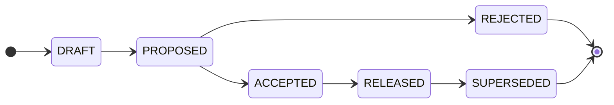

# Contributing

<!-- Agents MUST read ./AGENTS.md. This document is for humans. -->

These contributing guidelines provide step-by-step instructions for iterating on
product specifications.

The focus here is on the mechanics and guardrails of the proposal process. See
the [documentation](./docs/) for more general guidance on how to get the most
out of the SRS process.

The SRS is maintained by technical teams, in collaboration with product
managers. Product managers are ultimately responsible for accepting or rejecting
product proposals, and agreeing to their acceptance criteria. But it is the role
of technical leads to produce and maintain these artifacts, and to manage their
lifecycle.

Anyone with write access to this repository may propose changes to the
functional and non-functional requirements of the system, for product
consideration.

See also [TS-1](https://github.com/kieranpotts/standards/tree/latest/dev/src/001)
for the technical standard that underpins this process.

****
The capitalized words REQUIRED, MUST, MUST NOT, RECOMMENDED, SHOULD,
SHOULD NOT, OPTIONAL, and MAY herein are to be interpreted as described
in [IETF RFC 2119](https://www.ietf.org/rfc/rfc2119.txt).
****

## Lifecycle

The [specification artifacts](./specification/) on `main` always reflect the
current state of the system as experienced by real users in production right now.
Changes to that state are introduced through [proposals](./proposals/).

Each proposal moves through a defined state machine. The current state of a
proposal is shown in the document's `Status` field. In addition, to make it
easier to search and filter pending proposals, corresponding labels are applied
to open pull requests: `#proposed`, `#accepted`, etc.

The states are:

- `DRAFT`: The proposal is being written.

- `PROPOSED`: The proposal is complete and open for formal review, negotiation,
  and a final decision in collaboration with relevant stakeholders (both
  technical and non-technical).

- `ACCEPTED`: The proposal has been approved by the product managers and
  delivery plans have been formulated in the product's backlog.

- `REJECTED`: The proposal will not be taken forward.

- `RELEASED`: An accepted change request is now live in production.

- `SUPERSEDED`: A previously released proposal that is no longer in effect,
  because a later proposal replaced or removed the feature.

The following state transitions are permitted. They are intended to be simple,
memorable, and easy to enforce through automation and agentic workflows.


```mermaid
stateDiagram-v2
  direction LR
  [*] --> DRAFT
  DRAFT --> PROPOSED
  PROPOSED --> ACCEPTED
  PROPOSED --> REJECTED
  ACCEPTED --> RELEASED
  RELEASED --> SUPERSEDED
  REJECTED --> [*]
  SUPERSEDED --> [*]
```

| From       | To           | Condition                                 |
| ---------- | ------------ | ----------------------------------------- |
| _(new)_    | `DRAFT`      | Initial state, scaffolding the document.  |
| `DRAFT`    | `PROPOSED`   | Proposal and spec edits complete.         |
| `PROPOSED` | `ACCEPTED`   | Final comments wrapped. Ready. Accepted.  |
| `PROPOSED` | `REJECTED`   | Final comments concluded. Rejected.       |
| `ACCEPTED` | `RELEASED`   | Implementation shipped to production.     |
| `RELEASED` | `SUPERSEDED` | Superseded by a later proposal.           |

Transitions not listed are not permitted. A proposal MUST NOT move backwards
and MUST NOT skip states.

## Workflow

> [!TIP]
> [Agent skills](./.agents/skills/) are available to help automate some steps in
> this workflow. It is RECOMMENDED to use agents to drive state transitions.
> Doing so helps to maintain consistency.

A pull request is the formal vehicle for a proposal. Open it as a draft as soon
as you are ready to start writing the proposal document.

1.  Branch off `main` as `proposal/<slug>` for a feature or quality proposal, or
    as `epic/<slug>` for an epic. (An epic is a special case, encapsulating
    multiple interdependent proposals for easier tracking of dependencies.)

2.  Copy the [template](./proposals/TEMPLATE.md) to `proposals/<slug>/README.md`.
    Fill it out, describing the change in full – the rationale, the impact on
    the business and its customers, and the alternatives considered.

3.  Edit the [`specification/`](./specification/) artifacts to reflect the
    intended final state of the system after the change ships.

4.  Commit your changes and open the pull request as a draft, titled `feature:
    <description>`, `quality: <description>`, or `epic: <description>`, where
    `<description>` is a short prose title, written full lowercase. Apply
    exactly one type label to the PR – `FEATURE`, `QUALITY`, or `EPIC`. Fill
    out the top of the PR template (above the horizontal rule). Leave the
    checklist for now.

5.  Open a [discussion thread](https://github.com/kieranpotts/specs/discussions)
    using the appropriate form for the proposal type (feature, quality, or epic).
    Link the discussion and the pull request to each other, recording the thread
    in the proposal document's `Discussion thread` field.

6.  Keep the pull request in draft while you refine it. When the document and
    spec edits are complete and ready for full stakeholder review, mark the PR
    as ready for review (which takes it out of draft) and apply the
    `#proposed` label.

7.  Once stakeholders decide, apply the `#accepted` or `#rejected` label. If
    accepted, formulate delivery plans in the product's backlog.

8.  Once the change is live in production, apply the `#released` label and
    merge the pull request. If rejected, revert the specification edits before
    merging, and apply the `#rejected` label.

## Rules

- All artifacts MUST be written in American English.

- The `main` trunk MUST be treated as the default branch. The artifacts in the
  [`specification/`](./specification/) directory on `main` are the authoritative
  record of the system as it exists in production right now.

- A `FEATURE` or `QUALITY` proposal MUST be a single, atomic change – one
  requirement that can be reviewed, decided, and shipped independently of any
  other.

- An `EPIC` proposal MAY span multiple feature and quality requirements, for
  large-scale initiatives. Individual feature and quality proposals that are
  part of an epic MUST reference it via their `Depends on` field.

- Withdrawing a requirement MUST go through the proposal lifecycle like any
  other change. There is no lightweight path for removing behavior.

- The preserved `product-requirements.md` (the `Origin` PRD) MUST be treated as
  immutable from the moment it is written – stricter than the proposal
  document, which stays editable while the PR is open. It records the
  requirement as it arrived, before specification. Capture any change of
  understanding in the proposal `README.md` or the spec edits, never by editing
  the preserved PRD.

- A proposal SHOULD NOT move from `DRAFT` to `PROPOSED` until it is genuinely
  ready for review; early feedback MAY still be solicited via the discussion
  thread while still in `DRAFT`.

- Once a requirement is `PROPOSED`, from this point on in its lifecycle, the
  author SHOULD NOT make further material changes to the proposed
  specifications, except in response to reviewer feedback.

- The discussion thread MUST be closed when the PR is merged.

- A proposal MUST NOT be accepted unless its requirement meets the [Definition
  of Ready](./.agents/skills/write-spec/references/definition-of-ready.md). A
  sound-but-incomplete proposal is sent back for refinement, not accepted.

- A decision, once taken (`ACCEPTED` or `REJECTED`), MUST NOT be reversed by
  moving the proposal backwards. Instead, past decisions MAY be `SUPERSEDED` by
  new proposals.

- A proposal's pull request MUST stay open until the corresponding changes in
  code and configuration are in production; it is not enough for a proposal to
  be approved. Thus the `main` specification stays current with production.

- A proposal MUST be assigned a sequential number after merge, recorded in
  [`proposals/INDEX.md`](./proposals/INDEX.md) in a direct-to-`main` commit.

- The message of the squash commit MUST take the form `<type>: <description> -
  RELEASED|REJECTED`, where `<type>` is `feature`, `quality`, or `epic`.

- Once a proposal is merged into `main`, its document MUST be treated as
  immutable. To revisit a decision, open a new proposal that supersedes the
  original, cross-referenced via the `Supersedes` and `Superseded by` fields.

- A proposal document MUST NOT be deleted, including rejected ones.

- The GitHub issue tracker MUST be used only for maintenance work on this
  repository itself.

## Tools

### Pre-commit hooks

It is RECOMMENDED to install the [pre-commit](https://pre-commit.com) framework
to enable local validation hooks before committing. You need only to run the
following command once to install pre-commit system-wide:

```bash
pipx install pre-commit
```

Then install the pre-commit hooks in every local repository where you want
pre-commit checks to be run:

```bash
pre-commit install
```

This installs all hook types declared in `.pre-commit-config.yaml`
(`pre-commit`, `commit-msg`).

Edit `./.pre-commit-config.yaml` to configure the pre-commit validation checks
you want for your project. See the [pre-commit](https://pre-commit.com) docs for
details.

## Contributor license agreement

<!-- Delete this for closed source projects. -->

By opening a pull request to this repository, you accept and agree to the
following terms and conditions:

- You agree that your contribution may be distributed under the terms of the
  [CC0 1.0 Universal license](./LICENSE.txt), effectively releasing it to the
  public domain.

- You certify that your contribution is either created in whole by you and you
  have the right to distribute it under the designated license, or is based on a
  previous work with a compatible license that permits distribution and
  modification under the designated license.

- You understand and agree that your contribution is public and that a record of
  it, including all personal information you submit with it, is maintained
  indefinitely and may be redistributed consistent with the designated license.
