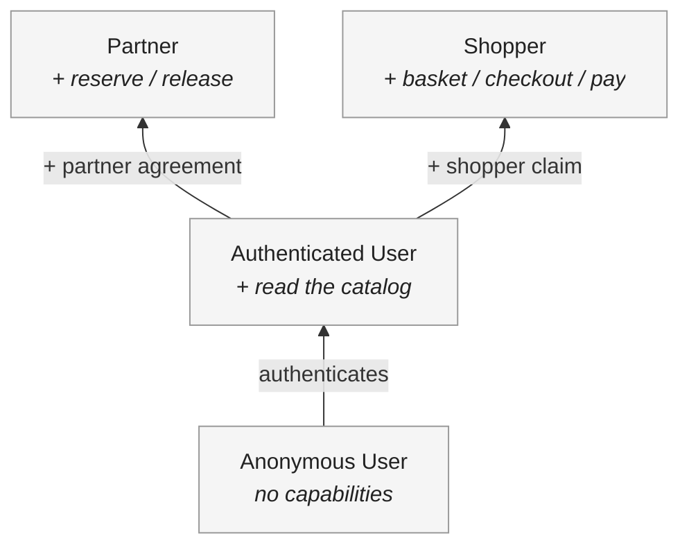

# Actors

This section profiles the actors that interact with the system — the people,
organizations, and external systems that have goals the system must serve.
Actors are part of the domain [model](../model/): they describe _who_
participates, not _what_ each is permitted to do. Permissions are specified
separately, in [access](../../requirements/behaviors/access/).

Different actors have different standing in the system, arranged as a hierarchy.
Understanding these distinctions matters, because even small differences between
actor types can have a significant impact on the system's design and the effort
required to build it.

The actors are derived from the [domain model](../model/).

## Actor hierarchy

Actors build on a common base. Every authenticated caller starts from the same
read capabilities; specific credential claims then add capability sets on top.
An actor holds every capability of the base it extends, plus whatever its claim
grants directly. The [access](../../requirements/behaviors/access/) matrix
records exactly which capabilities each actor holds.

The current actors are as follows:

- **Anonymous User:** A caller who has not authenticated.

- **Authenticated User:** A caller who has presented a valid credential — either
  a human operator using a client application, or an automated system making
  machine-to-machine requests. Authenticated Users may read the catalog but may
  not change its state.

- **Partner:** An Authenticated User belonging to an organization that holds a
  signed partner agreement (see [constraints](../constraints/)). A Partner
  inherits every read capability of an Authenticated User, and additionally may
  place and release [reservations](../glossary/) on products. Partner status is
  asserted by a claim in the caller's [credential](../glossary/), issued by the
  identity service.

- **Shopper:** An Authenticated User purchasing for themselves. A Shopper
  inherits every read capability of an Authenticated User, and additionally may
  assemble a [basket](../glossary/), [check out](../glossary/), and pay — moving
  the purchased products to `sold`. Shopper and Partner are two distinct
  capability sets over the same Authenticated User base, not a privilege ladder:
  a caller may hold either, both, or neither, according to the claims in its
  [credential](../glossary/).

_Add further actor types as needed._

Two caller-facing operations change catalog state: a Partner's reservation, and
a Shopper's purchase. The diagram below shows how each actor extends the
Authenticated User base; the [access](../../requirements/behaviors/access/)
matrix records exactly what each adds.

Read bottom-to-top as increasing capability: an Anonymous User who authenticates
becomes an Authenticated User; from there, a credential's claims determine
whether the caller is also a Partner, a Shopper, or both. Read capabilities
accumulate from the Authenticated User base; the reserve and purchase capability
sets are held independently.
