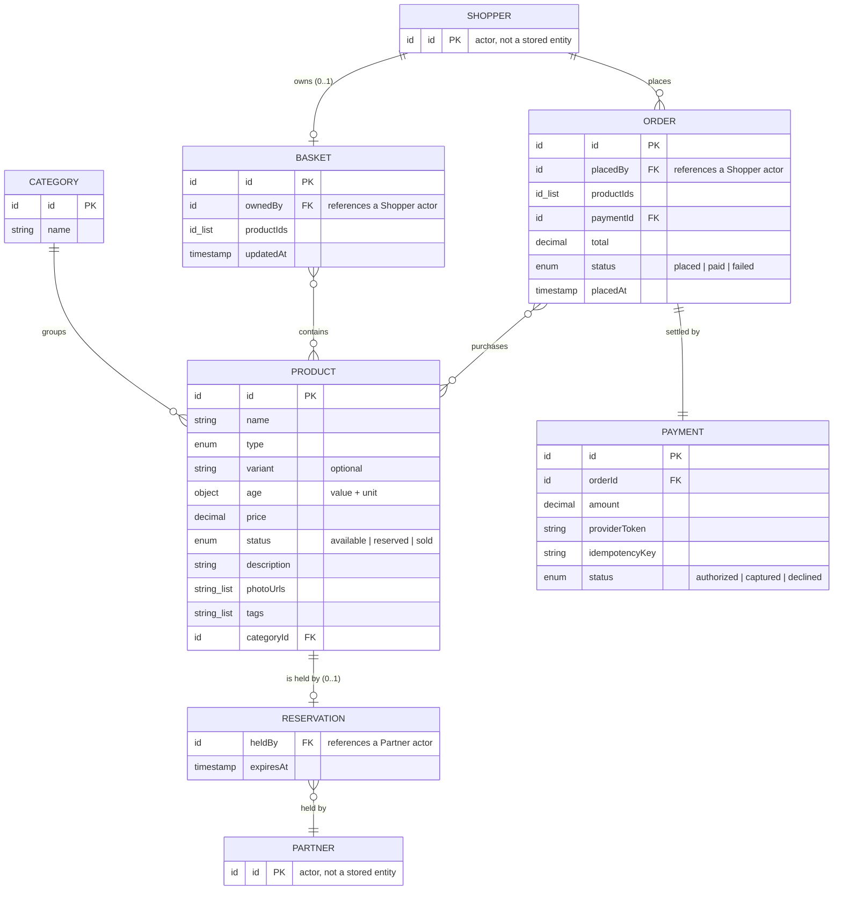
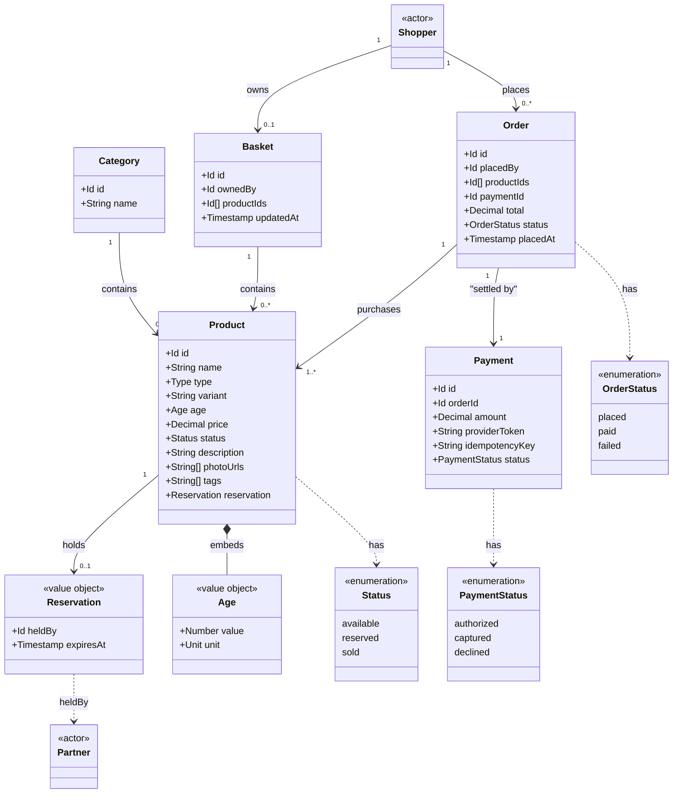

# Model

This section documents the entities in the system's domain model — the
categories of information the system stores — and how each entity type relates
to the others.

The domain model anchors the project's shared vocabulary (defined in full in the
[glossary](../glossary/)). The [actors](../actors/) and
[features](../../requirements/behaviors/features/) are derived from it, so
keeping the model accurate and unambiguous pays off across the whole
specification.

_Describe each entity, its meaningful attributes, and its relationships to other
entities. An entity-relationship diagram may be embedded here to summarize the
model visually._

## Entities

### Product

A `Product` is a single item available in the catalog. It is the primary entity
in the domain.

| Attribute | Type | Description |
| --------- | ---- | ----------- |
| `id` | Unique identifier | Stable, system-assigned identifier for the listing. |
| `name` | String | The given name of the individual product (eg. "Widget Pro"). |
| `type` | Enum | The product type category (eg. `furniture`, `electronics`, `apparel`, `kitchenware`, `outdoor`, `accessory`). |
| `variant` | String | The variant or style within the type (eg. "Oak Finish"). Optional; may be blank for single-variant products. |
| `age` | Object | Approximate time since manufacture, expressed as `{ value: number, unit: "weeks" | "months" | "years" }`. |
| `price` | Decimal | Asking price in the catalog's configured currency. |
| `status` | Enum | Current availability: `available`, `reserved`, or `sold`. |
| `description` | String | Free-text description of the product, its features, and care requirements. |
| `photoUrls` | Array of strings | One or more URLs pointing to images of the product. |
| `tags` | Array of strings | Freeform labels for search and filtering (eg. "eco-friendly", "handmade"). |
| `reservation` | Object | Present only while `status` is `reserved`. Records the holding [`Partner`](../actors/) and the time at which the [hold window](../glossary/) expires: `{ heldBy: PartnerId, expiresAt: timestamp }`. Absent when the product is `available` or `sold`. |

### Category

A `Category` groups products into broad catalog sections (eg. "Electronics",
"Apparel", "Furniture"). A `Product` belongs to exactly one `Category`.

| Attribute | Type | Description |
| --------- | ---- | ----------- |
| `id` | Unique identifier | Stable, system-assigned identifier. |
| `name` | String | Human-readable category name. |

### Basket

A `Basket` is a [Shopper](../actors/)'s working collection of products they
intend to buy, before checkout. It is transient: it exists only between the
Shopper first adding a product and either checking out or abandoning it.

| Attribute | Type | Description |
| --------- | ---- | ----------- |
| `id` | Unique identifier | Stable, system-assigned identifier. |
| `ownedBy` | Id | The [`Shopper`](../actors/) actor the basket belongs to. |
| `productIds` | Array of ids | The products currently in the basket. |
| `updatedAt` | Timestamp | When the basket was last modified. |

### Order

An `Order` records a completed purchase — the products a [Shopper](../actors/)
bought, and the [`Payment`](#payment) that settled it. Unlike a `Basket`, an
`Order` is durable: it is the permanent record of a sale.

| Attribute | Type | Description |
| --------- | ---- | ----------- |
| `id` | Unique identifier | Stable, system-assigned identifier. |
| `placedBy` | Id | The [`Shopper`](../actors/) actor that placed the order. |
| `productIds` | Array of ids | The products purchased, each of which moves to `sold`. |
| `paymentId` | Id | The [`Payment`](#payment) that settled the order. |
| `total` | Decimal | The order total in the catalog's configured currency. |
| `status` | Enum | Order lifecycle: `placed`, `paid`, or `failed` (see [rules](../../requirements/behaviors/rules/)). |
| `placedAt` | Timestamp | When the order was placed. |

### Payment

A `Payment` records the authorization and capture of a card payment for an
[`Order`](#order), performed through the external payment provider. The platform
stores only a provider-issued token and the result — never raw card data (see
[constraints](../constraints/)).

| Attribute | Type | Description |
| --------- | ---- | ----------- |
| `id` | Unique identifier | Stable, system-assigned identifier. |
| `orderId` | Id | The [`Order`](#order) this payment settles. |
| `amount` | Decimal | The amount captured, in the catalog's configured currency. |
| `providerToken` | String | Opaque token returned by the payment provider; no card data is stored. |
| `idempotencyKey` | String | Caller-supplied key that makes capture safe to retry (see [idempotence](../../requirements/qualities/idempotence.md)). |
| `status` | Enum | `authorized`, `captured`, or `declined`. |

## Relationships

- A `Product` belongs to exactly one `Category`.
- A `Category` may contain zero or more `Products`.
- A `Product` has at most one active `Reservation` — present only while its
  `status` is `reserved` (see [rule R3](../../requirements/behaviors/rules/)).
- A `Reservation` is held by exactly one [`Partner`](../actors/) actor.
- A `Basket` is owned by exactly one [`Shopper`](../actors/) and holds zero or
  more `Products`.
- An `Order` is placed by exactly one [`Shopper`](../actors/), purchases one or
  more `Products` (each moving to `sold`), and is settled by exactly one
  `Payment`.
- A `Payment` settles exactly one `Order`.

## Entity-relationship diagram

The diagram summarizes the entities above and the cardinality of their
relationships. `Reservation` is shown as a separate node for clarity, but it is
an embedded value on `Product` (the `reservation` attribute), not an
independently-addressable record. `Partner` is an [actor](../actors/), not a
stored entity; it appears here only to show what a reservation references.

The same model viewed as classes, which makes the embedded `Reservation` value
object and the `status` enum more explicit:

