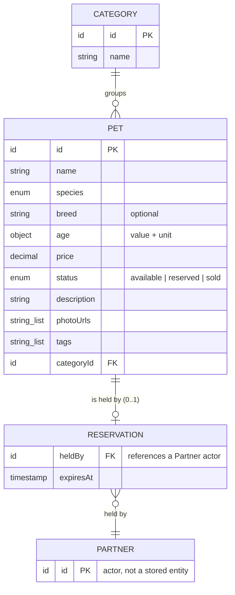
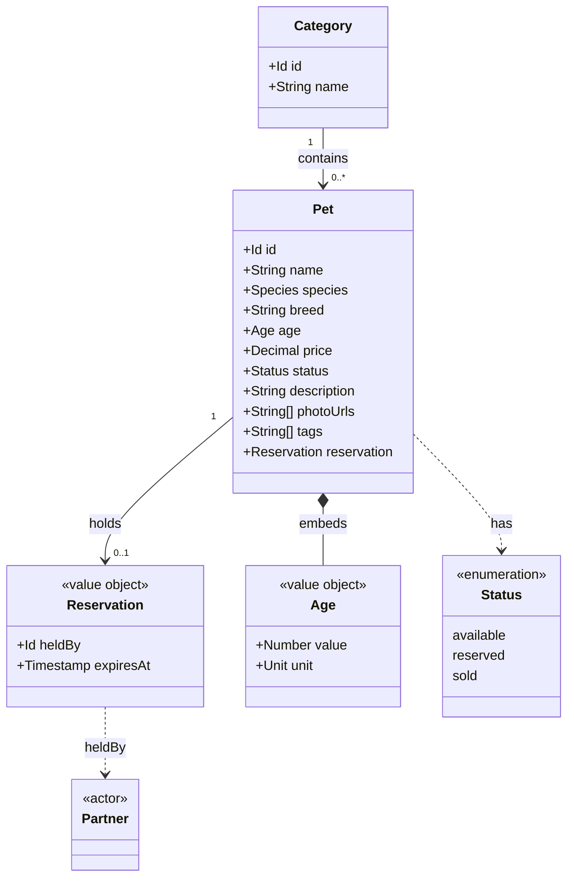

# Model

This section documents the entities in the system's domain model — the
categories of information the system stores — and how each entity type relates
to the others.

The domain model anchors the project's shared vocabulary (defined in full in the
[glossary](../glossary/)). The [actors](../actors/) and
[features](../../requirements/behaviors/features/) are derived from it, so
keeping the model accurate and unambiguous pays off across the whole
specification.

_Describe each entity, its meaningful attributes, and its relationships to other
entities. An entity-relationship diagram may be embedded here to summarize the
model visually._

## Entities

### Pet

A `Pet` is a single animal available in the catalog. It is the primary entity in
the domain.

| Attribute | Type | Description |
| --------- | ---- | ----------- |
| `id` | Unique identifier | Stable, system-assigned identifier for the listing. |
| `name` | String | The given name of the individual animal (eg. "Fido"). |
| `species` | Enum | The species category (eg. `dog`, `cat`, `bird`, `fish`, `reptile`, `small-animal`). |
| `breed` | String | The breed or variety within the species (eg. "Labrador Retriever"). Optional; may be blank for mixed-breed animals. |
| `age` | Object | Approximate age, expressed as `{ value: number, unit: "weeks" | "months" | "years" }`. |
| `price` | Decimal | Asking price in the catalog's configured currency. |
| `status` | Enum | Current availability: `available`, `reserved`, or `sold`. |
| `description` | String | Free-text description of the animal, its temperament, and care requirements. |
| `photoUrls` | Array of strings | One or more URLs pointing to images of the animal. |
| `tags` | Array of strings | Freeform labels for search and filtering (eg. "hypoallergenic", "house-trained"). |
| `reservation` | Object | Present only while `status` is `reserved`. Records the holding [`Partner`](../actors/) and the time at which the [hold window](../glossary/) expires: `{ heldBy: PartnerId, expiresAt: timestamp }`. Absent when the pet is `available` or `sold`. |

### Category

A `Category` groups pets into broad catalog sections (eg. "Dogs", "Cats",
"Birds"). A `Pet` belongs to exactly one `Category`.

| Attribute | Type | Description |
| --------- | ---- | ----------- |
| `id` | Unique identifier | Stable, system-assigned identifier. |
| `name` | String | Human-readable category name. |

## Relationships

- A `Pet` belongs to exactly one `Category`.
- A `Category` may contain zero or more `Pets`.
- A `Pet` has at most one active `Reservation` — present only while its `status`
  is `reserved` (see [rule R3](../../requirements/behaviors/rules/)).
- A `Reservation` is held by exactly one [`Partner`](../actors/) actor.

## Entity-relationship diagram

The diagram summarises the entities above and the cardinality of their
relationships. `Reservation` is shown as a separate node for clarity, but it is
an embedded value on `Pet` (the `reservation` attribute), not an
independently-addressable record. `Partner` is an [actor](../actors/), not a
stored entity; it appears here only to show what a reservation references.

The same model viewed as classes, which makes the embedded `Reservation` value
object and the `status` enum more explicit:

