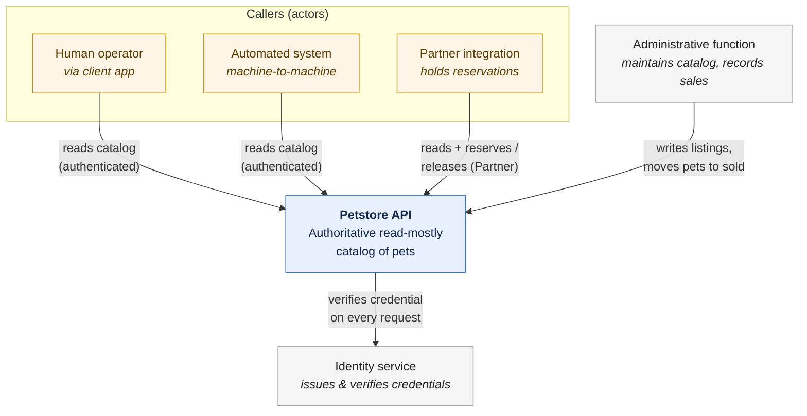

# System context

This diagram places the Petstore API in its external landscape — the actors that
call it, and the external systems it depends on. It is a
[C4](https://c4model.com/) system-context view: a single box for the system
itself, surrounded by the people and systems it interacts with. Internal
structure is deliberately omitted; that is an implementation concern recorded in
the [RFC repository](https://github.com/kieranpotts/rfc), not the specification.

The participants shown here are defined elsewhere: the callers are
[actors](../actors/), and the external systems are
[dependencies](../constraints/). This view only shows how they connect.

**How to read it:**

- **Callers** sit on the left of the flow and only ever _read_ the catalog —
  except a **Partner**, which may also reserve and release pets. Every caller is
  authenticated; an [Anonymous User](../actors/) reaches no further than
  rejection and so is not shown as a successful interaction.

- The **Petstore API** is the system this specification describes. It is
  read-mostly: the only state callers can change is a pet's reservation hold.

- The **identity service** is an external [dependency](../constraints/): the API
  verifies a [credential](../glossary/) with it on every request and cannot
  authorize anything without it.

- The **administrative function** is outside this system's [scope](./scope.md).
  It is the only source of catalog content (creating and editing listings) and
  the only actor that moves a pet to `sold`. The API exposes that data but never
  originates it.
