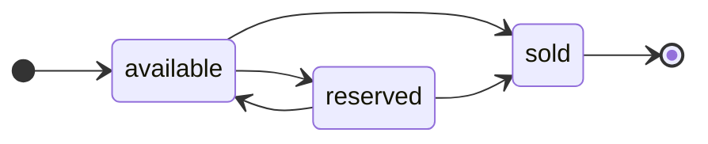

# Rules

This section documents the business rules, invariants, and policies that hold
across the system — the constraints that are not tied to any single
[feature](../features/) but apply wherever the relevant entities and operations
appear.

Capturing them here, once, keeps them authoritative: a [feature](../features/)
scenario references a rule by its identifier rather than restating it, so each
invariant lives in exactly one place. Rules also document the lifecycle of
domain entities — the states a [model](../../../context/model/) entity can hold,
and the transitions permitted between them.

State each rule so that it is unambiguous and, where possible, testable. Give
each a stable identifier so it can be referenced from elsewhere.

_Replace the illustrative rules below with your own._

## Invariants

- **R1 — Single status.** A [`Product`](../../../context/model/) has exactly one
  `status` at any time: `available`, `reserved`, or `sold`. It is never in more
  than one state at once.

- **R2 — Catalog records are read-only to callers.** No caller-facing operation
  creates, edits, or deletes a `Product` record, nor changes any attribute other
  than `status`. The descriptive catalog (names, prices, descriptions, photos,
  tags) is maintained solely through a separate administrative function (see
  [scope](../../../context/overview/scope.md)). The two exceptions both change
  only `status`: reservation operations (R3–R5), and Shopper checkout (R6–R8).

- **R3 — Reservation requires an available product.** A
  [Partner](../../../context/actors/) may reserve a `Product` only when its
  `status` is `available`. Reserving moves the product to `reserved` and
  records the reserving Partner as the holder. A request to reserve a product
  that is already `reserved` or `sold` is rejected, and the product's state is
  unchanged.

- **R4 — Only the holder may release.** A `reserved` product may be returned to
  `available` by a caller-facing operation only when the caller is the
  [Partner](../../../context/actors/) that holds the reservation. Any other
  caller's release request is rejected without changing state. A reservation may
  also lapse automatically (R5); that path is not caller-triggered.

- **R5 — Reservations expire.** A reservation that is neither released nor
  advanced to `sold` within its hold window automatically lapses, returning the
  product to `available`. The hold window is a configuration value, not a caller
  input. Expiry is observable to callers only as a subsequent `available`
  status.

- **R6 — Checkout requires purchasable products.** A [Shopper](../../../context/actors/)
  may check out a basket only if every product in it is either `available`, or
  `reserved` by a hold the Shopper's own checkout consumes. A product that is
  `sold`, or `reserved` by a different holder, makes the whole checkout fail
  without moving any product's status.

- **R7 — Payment precedes sale.** A product moves to `sold` through checkout only
  after its [`Payment`](../../../context/model/) is `captured`. If payment is
  declined or the provider is unavailable, no product in the basket moves to
  `sold` (R8). Payment capture is idempotent under a caller-supplied key, so a
  retried checkout never captures twice (see
  [idempotence](../../qualities/idempotence.md)).

- **R8 — Failed checkout leaves no product sold.** If a checkout fails at any
  step — an unpurchasable product (R6), a declined payment, or a provider outage
  (R7) — every product in the basket is left in the status it held before
  checkout began, and any reservation the checkout would have consumed is
  released back to `available`. A failed checkout never leaves a product in a
  partially-purchased state.

## Lifecycle: Product status

A `Product`'s `status` (defined in the [model](../../../context/model/)) moves
through the states below. Only the transitions shown are permitted. The
transitions into and out of `reserved` are caller-triggerable by a
[Partner](../../../context/actors/) (R3–R5); the transition into `sold` is now
caller-triggerable by a [Shopper](../../../context/actors/) through checkout
(R6–R8), and may also occur administratively. The resulting states are
observable to all authenticated callers.

- **available → reserved.** A [Partner](../../../context/actors/) places the
  product on hold (R3), or the administrative function does so. The reserving Partner is
  recorded as the holder.

- **reserved → available.** The holding Partner releases the reservation (R4),
  the reservation lapses (R5), or the administrative function releases it —
  returning the product to the catalog.

- **available → sold.** A [Shopper](../../../context/actors/) buys an available
  product through checkout, once payment is captured (R7), or the administrative
  function records the sale.

- **reserved → sold.** A reserved product is purchased — the holder's own checkout
  consumes the hold (R6) once payment is captured (R7), or the administrative
  function records the sale. `sold` is terminal — a sold product undergoes no
  further transitions.

No other transitions are valid. In particular, a product never returns from
`sold`, and a failed checkout moves no product into `sold` (R8).
