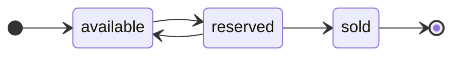

# Rules

This section documents the business rules, invariants, and policies that hold across the system — the constraints that are not tied to any single [feature](../features/) but apply wherever the relevant entities and operations appear.

Capturing them here, once, keeps them authoritative: a [feature](../features/) scenario references a rule by its identifier rather than restating it, so each invariant lives in exactly one place. Rules also document the lifecycle of domain entities — the states a [model](../../../context/model/) entity can hold, and the transitions permitted between them.

State each rule so that it is unambiguous and, where possible, testable. Give each a stable identifier so it can be referenced from elsewhere.

_Replace the illustrative rules below with your own._

## Invariants

- **R1 — Single status.** A [`Pet`](../../../context/model/) has exactly one `status` at any time: `available`, `reserved`, or `sold`. It is never in more than one state at once.

- **R2 — Catalog is read-only to callers.** No caller-facing operation creates, modifies, or deletes a `Pet`. Catalog data is maintained through a separate administrative function (see [scope](../../../context/overview/scope.md)).

## Lifecycle: Pet status

A `Pet`'s `status` (defined in the [model](../../../context/model/)) moves through the states below. Only the transitions shown are permitted. The transitions themselves are driven by the administrative function — they are out of scope for the read-only catalog this system exposes — but the resulting states are observable to callers.

- **available → reserved.** The pet is placed on hold.

- **reserved → available.** A reservation lapses or is released, returning the pet to the catalog.

- **reserved → sold.** A reserved pet is purchased. `sold` is terminal — a sold pet undergoes no further transitions.

No other transitions are valid. In particular, a pet cannot move directly from `available` to `sold`, nor return from `sold`.
